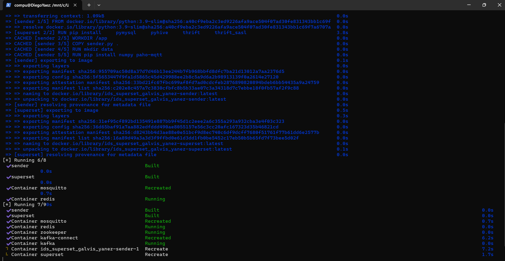
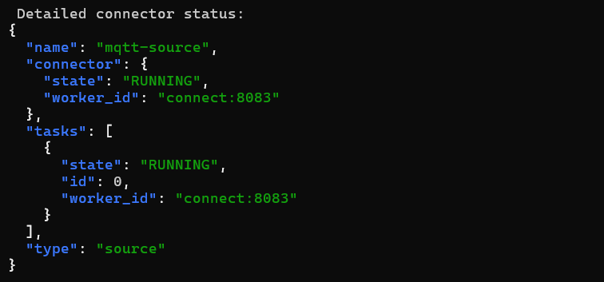
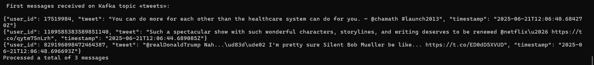

# Infrastructures for Data Science Final Project

The main objective of this project is the design and implementation of a data infrastructure architecture capable of integrating, processing, and jointly analyzing both static and temporal data extracted from Twitter.

To achieve this, the project leverages transmission and storage technologies such as *MQTT*, *Kafka*, *Druid*, Hive, and *Superset*, with the aim of enabling a data visualization environment that supports data-driven decision-making.

The development of this project is focused on exploring and applying various data infrastructure tools within a Dockerized environment.

## 1. 🔁📊 Pipeline - Temporal Data (tweets.json)

The objective of this part of the project is to build a data ingestion pipeline into data visualization tools such as *Superset*, simulating a real-time environment for temporal data from the file *tweets.json*. This file represents a dynamic data source to be processed as a stream, and contains multiple tweets posted by users at different intervals.

The pipeline enables users to make data-driven decisions by visualizing the information interactively through Business Intelligence tools.

To achieve this, a distributed architecture has been designed to simulate a production-like environment using Docker containers. The data flow follows the steps described below.

#### 1.1 MQTT 

*MQTT* is a lightweight messaging protocol used to transmit data between a publisher and a subscriber.

A Python script *(sender.py*) is responsible for reading tweets from the tweets.json file and publishing them one by one to an *MQTT* topic named *tweets*.

#### 1.2 Broker MQTT: Mosquitto 

It acts as an intermediary between the publishers and subscribers of the messaging topic, receiving the messages published to the *tweets*   topic and routing them to the respective subscribers.

#### 1.3 Kafka Connect

It enables the integration of external systems with *Kafka*.

It provides two types of connectors: one that allows data to be ingested into *Kafka* from external systems (in this case, *MQTT*), and another that allows data to be exported from *Kafka* to external systems (*Druid*).

#### 1.4 Apache Kafka

A distributed real-time messaging platform designed to handle large volumes of data in a persistent and scalable way. It receives data from the *MQTT* messaging protocol, specifically from the topic named tweets.

#### 1.5 Apache Druid

*Druid* is a real-time analytics database designed for fast querying over large volumes of data (especially temporal data). It is responsible for consuming messages from the tweets topic and structuring them for user-friendly analytical exploration.

To achieve this, **Druid** relies on the following components:

| Component        | Function                                                                 |
|------------------|--------------------------------------------------------------------------|
| **Broker**        | Receives queries from *Superset* and coordinates their execution.          |
| **Historical**    | Stores and queries historical data.                                      |
| **MiddleManager** | Ingests data from sources like *Kafka* in real time.                       |
| **Coordinator**   | Manages the distribution and availability of data across the cluster.    |
| **Router**        | Routes requests to the appropriate component.                            |

#### 1.6 Superset 

It is an open-source Business Intelligence tool that allows users to visualize, explore, and analyze data interactively through a web interface. It supports connections to multiple databases, enables direct execution of SQL queries, and provides interactive charting capabilities. Thanks to its integration with tools like *Druid*, it is ideal for exploring large volumes of data.

In this project, it serves as the component that allows real-time visualization of tweets and enables analytical exploration of the data processed through the pipeline.


### 🛠️ Procedure

In order to replicate the pipeline for process and managment the temporal data, follow this steps:

1. Open a terminal in the working directory and execute the following command:```bash ./start_pipeline.sh```.


The *.sh* script will start all the required services for the project using: ```bash docker compose up --build -d ```.

- zookeeper
- Kafka
- Kafka-connect
- mosquitto
- sender
- redis
- *Superset*





After waiting for **Kafka* Connect to initialize, the *MQTT* → *Kafka* connector will be registered with the following configuration:

```json
{
  "connector.class": "io.confluent.connect.*MQTT*.MqttSourceConnector",
  "tasks.max": 1,
  "*MQTT*.server.uri": "tcp://mosquitto:1883",
  "*MQTT*.topics": "tweets",
  "*Kafka*.topic": "tweets",
  "value.converter": "org.apache.*Kafka*.connect.converters.ByteArrayConverter",
  "confluent.topic.bootstrap.servers": "*Kafka*:9092",
  "confluent.topic.replication.factor": 1
}
```




Once the connector has been successfully initialized, the first messages received in *Kafka* can be visualized.

```bash
docker exec -it *Kafka*-connect \
  *Kafka*-console-consumer \
    --bootstrap-server *Kafka*:9092 \
    --topic tweets \
    --from-beginning \
    --property print.value=true \
    --max-messages 3
```




Visualizing the messages in the console confirms that *Kafka* is already receiving messages from the tweets topic, so we can proceed to start *Druid*.


docker run -d --name *Druid* \
  --network *Kafka*-net \
  -p 8888:8888 -p 8082:8082 -p 8081:8081 \
  -e DRUID_XMS=512m -e DRUID_XMX=1g \
  -e DRUID_EXTENSIONS_LOADLIST='["*Druid*-*Kafka*-indexing-service"]' \
  fokkodriesprong/docker-*Druid*


2. Once *Druid* has been initialized, we can access it at localhost:8888.


We navigate to the Load Data section and connect our data via Apache *Kafka*.


We fill in the required fields for ingestion. In Bootstrap servers, we must specify the address of the *Kafka* broker that *Druid* should connect to in order to consume messages — in our case, *Kafka*:9092. In Topic, we specify the *Kafka* topic from which to read the messages. Then, we click Apply.


3. We access *Superset* through localhost:8088 and fill in the username and password fields (admin - admin). 


We navigate to the Databases section, where we should be able to see our tweets data in order to generate visualizations.


### Requirements

1. jq
2. Docker


## Authors

Diego Yáñez


Jorge Galvis