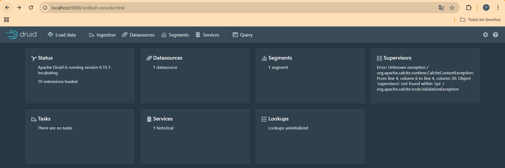
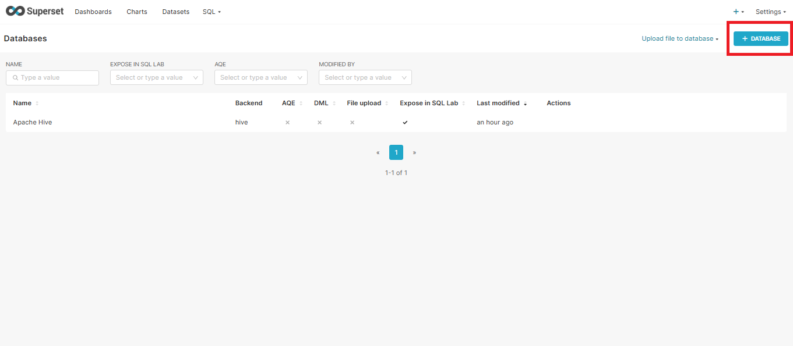
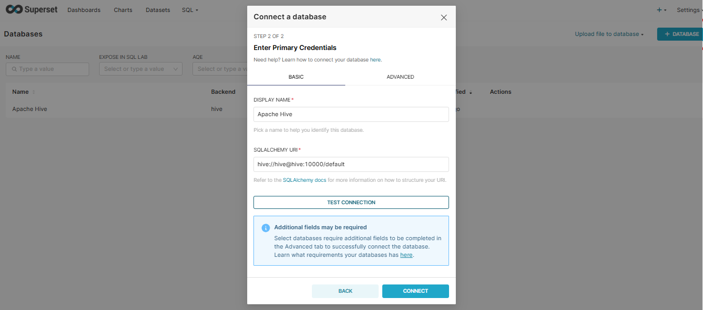
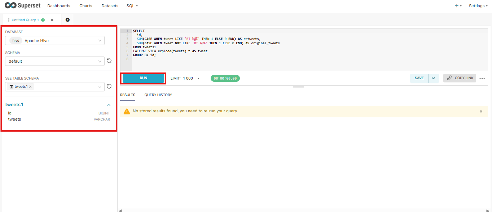

# Infrastructures for Data Science Final Project

The main objective of this project is the design and implementation of a data infrastructure architecture capable of integrating, processing, and jointly analyzing both static and temporal data extracted from Twitter.

To achieve this, the project leverages transmission and storage technologies such as *MQTT*, *Kafka*, *Druid*, Hive, and *Superset*, with the aim of enabling a data visualization environment that supports data-driven decision-making.

The development of this project is focused on exploring and applying various data infrastructure tools within a Dockerized environment.

## 1. 🔁📊 Pipeline - Temporal Data (tweets.json)

The objective of this part of the project is to build a data ingestion pipeline into data visualization tools such as *Superset*, simulating a real-time environment for temporal data from the file *tweets.json*. This file represents a dynamic data source to be processed as a stream, and contains multiple tweets posted by users at different intervals.

The pipeline enables users to make data-driven decisions by visualizing the information interactively through Business Intelligence tools.

To achieve this, a distributed architecture has been designed to simulate a production-like environment using Docker containers. The data flow follows the steps described below.

#### 1.1 MQTT 

*MQTT* is a lightweight messaging protocol used to transmit data between a publisher and a subscriber.

A Python script *(sender.py*) is responsible for reading tweets from the tweets.json file and publishing them one by one to an *MQTT* topic named *tweets*.

#### 1.2 Broker MQTT: Mosquitto 

It acts as an intermediary between the publishers and subscribers of the messaging topic, receiving the messages published to the *tweets*   topic and routing them to the respective subscribers.

#### 1.3 Kafka Connect

It enables the integration of external systems with *Kafka*.

It provides two types of connectors: one that allows data to be ingested into *Kafka* from external systems (in this case, *MQTT*), and another that allows data to be exported from *Kafka* to external systems (*Druid*).

#### 1.4 Apache Kafka

A distributed real-time messaging platform designed to handle large volumes of data in a persistent and scalable way. It receives data from the *MQTT* messaging protocol, specifically from the topic named tweets.

#### 1.5 Apache Druid

*Druid* is a real-time analytics database designed for fast querying over large volumes of data (especially temporal data). It is responsible for consuming messages from the tweets topic and structuring them for user-friendly analytical exploration.

To achieve this, **Druid** relies on the following components:

| Component        | Function                                                                 |
|------------------|--------------------------------------------------------------------------|
| **Broker**        | Receives queries from *Superset* and coordinates their execution.          |
| **Historical**    | Stores and queries historical data.                                      |
| **MiddleManager** | Ingests data from sources like *Kafka* in real time.                       |
| **Coordinator**   | Manages the distribution and availability of data across the cluster.    |
| **Router**        | Routes requests to the appropriate component.                            |

#### 1.6 Superset 

It is an open-source Business Intelligence tool that allows users to visualize, explore, and analyze data interactively through a web interface. It supports connections to multiple databases, enables direct execution of SQL queries, and provides interactive charting capabilities. Thanks to its integration with tools like *Druid*, it is ideal for exploring large volumes of data.

In this project, it serves as the component that allows real-time visualization of tweets and enables analytical exploration of the data processed through the pipeline.


### 🛠️ Procedure

In order to replicate the pipeline for process and managment the temporal data, follow this steps:

1. Open a terminal in the working directory and execute the following command:```bash ./start_pipeline.sh```.


The *.sh* script will start all the required services for the project using: ```bash docker compose up --build -d ```.

- zookeeper
- Kafka
- Kafka-connect
- mosquitto
- sender
- redis
- *Superset*


After waiting for **Kafka* Connect to initialize, the *MQTT* → *Kafka* connector will be registered with the following configuration:

```json
{
  "connector.class": "io.confluent.connect.*MQTT*.MqttSourceConnector",
  "tasks.max": 1,
  "*MQTT*.server.uri": "tcp://mosquitto:1883",
  "*MQTT*.topics": "tweets",
  "*Kafka*.topic": "tweets",
  "value.converter": "org.apache.*Kafka*.connect.converters.ByteArrayConverter",
  "confluent.topic.bootstrap.servers": "*Kafka*:9092",
  "confluent.topic.replication.factor": 1
}
```


Once the connector has been successfully initialized, the first messages received in *Kafka* can be visualized.

```bash
docker exec -it *Kafka*-connect \
  *Kafka*-console-consumer \
    --bootstrap-server *Kafka*:9092 \
    --topic tweets \
    --from-beginning \
    --property print.value=true \
    --max-messages 3
```


Visualizing the messages in the console confirms that *Kafka* is already receiving messages from the tweets topic, so we can proceed to start *Druid*.


docker run -d --name *Druid* \
  --network *Kafka*-net \
  -p 8888:8888 -p 8082:8082 -p 8081:8081 \
  -e DRUID_XMS=512m -e DRUID_XMX=1g \
  -e DRUID_EXTENSIONS_LOADLIST='["*Druid*-*Kafka*-indexing-service"]' \
  fokkodriesprong/docker-*Druid*


2. Once *Druid* has been initialized, we can access it at localhost:8888.



We navigate to the Load Data section and connect our data via Apache *Kafka*.


We fill in the required fields for ingestion. In Bootstrap servers, we must specify the address of the *Kafka* broker that *Druid* should connect to in order to consume messages — in our case, *Kafka*:9092. In Topic, we specify the *Kafka* topic from which to read the messages. Then, we click Apply.


3. We access *Superset* through localhost:8088 and fill in the username and password fields (admin - admin). 


We navigate to the Databases section, where we should be able to see our tweets data in order to generate visualizations.


**NOTE:** Although all services were successfully launched, we were unable to complete the ingestion into *Druid*. As a workaround, the dynamic data was loaded into *Hive* to enable visualizations.

### Requirements

1. jq
2. Docker


## 📁📊 Static Data (users1.json, edges1.json, mbti_labels.csv)

This part of the project focuses on the ingestion, transformation, and analysis of static data from local files: users1.json, edges1.json, and mbti_labels.csv. These files contain structured information about Twitter users, their following, and their MBTI personality types, respectively.

The goal is to convert this information into analytical tables that can be queried and visualized through tools such as Apache Superset, using Hive as a distributed query engine.

To achieve this, an automated pipeline was implemented to prepare the data, load it into Hive, and make it available in Superset for further analysis.

#### 2.1 Apache Hive

Apache Hive is a data warehouse system built on Hadoop that enables the analysis of large volumes of data using a SQL-like language called HiveQL. Hive translates these queries into MapReduce jobs, facilitating interaction with data stored in structured formats.

In this project, Hive acts as a repository and query engine for static data, allowing tools like Superset to easily explore and visualize it. Thanks to its SQL support, it is ideal for integrating processed data into analytical environments accessible to non-technical users.

### 🛠️ Procedure

1. Preprocessing with jQ

An automated script (hive_pipeline.sh) transforms JSON files into JSONL (JSON Lines) format for easier processing by Hive. It also makes adjustments to lists encoded as comma-separated strings.


2. Folder Organization

Structured folders are created within /workspace/data/ to facilitate the orderly ingestion of each dataset.

3. Loading to Hive

Once Hive is up and running, the hive-init container runs the load script, which creates the necessary tables in Hive and loads the transformed data.

4. Access from Superset

Finally, Superset connects to the Hive database and allows exploration and visualization of this static data.

To activate this section of the pipeline:

```bash docker-compose -f docker-compose-static.yml ```.

Once the process runs successfully, access the network where the project is being deployed from a web browser. By default, it launches on localhost:8088. The login, by default, is defined as the user admin and the password admin. This can be modified in the superset service in docker-compose-static.yaml if desired.

Once you log in, this is what the Superset welcome page should look like. To connect to the Hive database, click Settings, then Database Connections:


Then, click on CREATE DATABASE:



A pop-up window will appear, where you must select Apache Hive from the drop-down list. After that, in the SQLAlchemy URI* box, enter the connection link to where Hive is located on your internal network. By default, this is used: hive://hive@hive:10000/default  



Click Connect, and you're now connected to Superset by Hive.

To run SQL queries and process data, access SQL Lab through the main menu:


The database is selected and then the desired queries can be performed:




## Visualizations

Once the temporal and static data processing pipeline has been executed, the data becomes available for visualization and analysis in **Superset**.

In this web-based visualization tool, you can run **Hive-SQL** queries to explore, transform, and aggregate the stored data. This enables the creation of interactive charts and customized dashboards that help identify relevant patterns and trends.


These queries allow us to explore and filter the database to generate visualizations that address key business questions. For example:

- Who are the users with the highest number of interactions?
- Which MBTI personality type generates the most content on Twitter?
- Which profile accumulates the most retweets, favorites, or mentions?
- What is the distribution of interactions across different personality types?

Below is a dashboard designed to help answer these questions:


- **Top Left:** A pie chart titled **Tweet Distribution by MBTI** displays the proportion of tweets posted by users of each of the 16 MBTI personality types. It highlights **INTJ**, **ENFP**, **INFJ**, and **INFP** as the most active personalities in terms of posting tweets.

- **Top Right:** A table titled **Top 5 Most Engaged Users on Twitter**, sorted by total number of interactions. Each row shows the user’s *screen name* along with their retweets, favorites, mentions, and total engagement.

- **Bottom Left:** A horizontal bar chart titled **Total Favorites by MBTI Personality** presents the total number of likes received by each MBTI type. **INTJ** stands out with the most favorites, a result aligned with their high tweet activity. It also surpasses **ENFP** and **INFJ**, despite their similar posting volume.

- **Bottom Right:** A vertical bar chart titled **Total Retweets by MBTI Personality** displays the total retweet count per personality. Here, **ENFP** leads in generating engagement, followed by **ENFJ**, **INFP**, **INTP**, and again **INTJ**.

> These charts could be enhanced—for instance, by sorting bar charts in descending order to improve visual impact. However, the main goal was to demonstrate successful data integration, interaction, and visualization using **Superset**.

The dashboard is shown again below in higher resolution, exported directly from Hive. The earlier screenshot was only meant to verify that the service was deployed.


## Authors

Diego Yáñez


Jorge Galvis